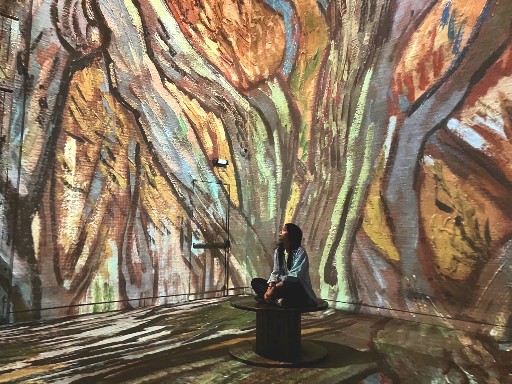
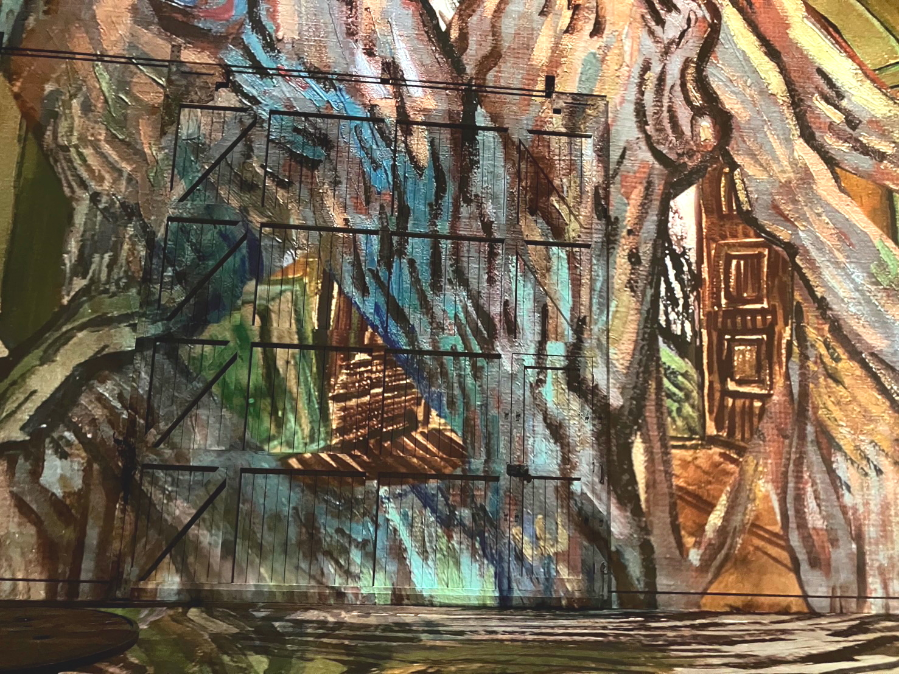

# 2024_paris2

<html lang="ja">
 <head>
  <meta charset="utf-8" />
 

<link href="https://cdnjs.cloudflare.com/ajax/libs/lightbox2/2.7.1/css/lightbox.css" rel="stylesheet">
   
</head>
<!--
<body onload="alert('65歳まで、よく頑張りました！　まだまだ元気に〜〜(^o^)/')" onunload="alert('再会の時まで、元気でお過ごしくださいませ〜(^o^)/')">
-->

  モバイル端末をお使いの場合は、画面を横向きにするとより見やすくご覧頂けます。

<!--
-->

<a href="https://torokoid.github.io/2024_paris/">2024年7月19日〜21日</a>>22日〜
<!--
-->

 &nbsp;Bruce 22日〜

<!--
<h2><a href="https://torokoid.github.io/list">クラス会名簿リンク</a></h2>
-->
  

 アクセス用QRコード

<marquee direction="right" scrollamount="20" width="30%">(^_^)/~hada</marquee>

<h2><marquee behavior="left">!!! 2024年7月、Bruceがパリアトリエ•デ•リュミリエールで日本特集とゴッホ特集 !!!</marquee></h2>
<!--

-->

<h3> ～～～2024年7月22日、館内の展示品画像、これ撮影できるとは！～～～  </h3>

<h3> ～～～ここからは動画です～～～  </h3>

<iframe width="560" height="315" src="https://www.youtube.com/embed/CdkvQjeTqJY?si=vYUfsXow1AGgzqeR" title="YouTube video player" frameborder="0" allow="accelerometer; autoplay; clipboard-write; encrypted-media; gyroscope; picture-in-picture; web-share" referrerpolicy="strict-origin-when-cross-origin" allowfullscreen></iframe>

<iframe width="560" height="315" src="https://www.youtube.com/embed/aB66zgQum5s?si=yy2S8RMbbuOrARiq" title="YouTube video player" frameborder="0" allow="accelerometer; autoplay; clipboard-write; encrypted-media; gyroscope; picture-in-picture; web-share" referrerpolicy="strict-origin-when-cross-origin" allowfullscreen></iframe>

<iframe width="560" height="315" src="https://www.youtube.com/embed/YPDjlo6CElo?si=qzMd780kWt-zhfha" title="YouTube video player" frameborder="0" allow="accelerometer; autoplay; clipboard-write; encrypted-media; gyroscope; picture-in-picture; web-share" referrerpolicy="strict-origin-when-cross-origin" allowfullscreen></iframe>

<iframe width="560" height="315" src="https://www.youtube.com/embed/Km7MRWt2TpI?si=1WB-oEkFk3BENnSx" title="YouTube video player" frameborder="0" allow="accelerometer; autoplay; clipboard-write; encrypted-media; gyroscope; picture-in-picture; web-share" referrerpolicy="strict-origin-when-cross-origin" allowfullscreen></iframe>

<iframe width="560" height="315" src="https://www.youtube.com/embed/VKRhtFbuJCg?si=uvgpyvxbg8xJXxyq" title="YouTube video player" frameborder="0" allow="accelerometer; autoplay; clipboard-write; encrypted-media; gyroscope; picture-in-picture; web-share" referrerpolicy="strict-origin-when-cross-origin" allowfullscreen></iframe>

<iframe width="560" height="315" src="https://www.youtube.com/embed/v65BD2Kvj74?si=JYDYvFyE4iM7PtOF" title="YouTube video player" frameborder="0" allow="accelerometer; autoplay; clipboard-write; encrypted-media; gyroscope; picture-in-picture; web-share" referrerpolicy="strict-origin-when-cross-origin" allowfullscreen></iframe>

<iframe width="560" height="315" src="https://www.youtube.com/embed/KhLbg3-AJ2M?si=EDyL1UEs1DyLfXnP" title="YouTube video player" frameborder="0" allow="accelerometer; autoplay; clipboard-write; encrypted-media; gyroscope; picture-in-picture; web-share" referrerpolicy="strict-origin-when-cross-origin" allowfullscreen></iframe>

<iframe width="560" height="315" src="https://www.youtube.com/embed/VQSDm6V_yNA?si=G4A-wJwqfN0vQLvm" title="YouTube video player" frameborder="0" allow="accelerometer; autoplay; clipboard-write; encrypted-media; gyroscope; picture-in-picture; web-share" referrerpolicy="strict-origin-when-cross-origin" allowfullscreen></iframe>

<h2><marquee behavior="left">!!! ここから日本特集、最後に戦場のメリークリスマス !!!</marquee></h2>

      

                             

                             
        

  

 

<!-- フッタ -->
 <footer>
 <h3>Copyright 2024/Jul/23 S.Hada</h3>
 </footer>
